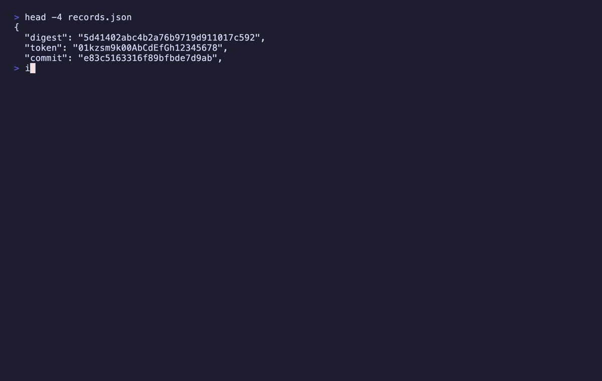

<p align="center">
  
</p>
<h1 align="center">IDs-LE: The ID That Only Looks Like One</h1>
<p align="center">
  <b>Find every identifier in a document, decode the time inside it, and refuse the ones that cannot be named</b><br/>
  <i>UUID · ULID · NanoID · MongoDB ObjectId · Snowflake</i>
</p>

<p align="center">
  <a href="https://marketplace.visualstudio.com/items?itemName=nolindnaidoo.ids-le">
    
  </a>
  <a href="https://open-vsx.org/extension/nolindnaidoo/ids-le">
    
  </a>
  <a href="https://www.npmjs.com/package/ids-le-mcp">
    
  </a>
  <a href="https://crates.io/crates/ids-le">
    
  </a>
  <a href="https://letools.dev/tools/ids-le">
    
  </a>
</p>

---

> **Useful?** A star or rating is how other developers find it —
> [★ GitHub](https://github.com/nolindnaidoo/ids-le) ·
> [★ Open VSX](https://open-vsx.org/extension/nolindnaidoo/ids-le/reviews) ·
> [★ Marketplace](https://marketplace.visualstudio.com/items?itemName=nolindnaidoo.ids-le&ssr=false#review-details)

## What it does

A support ticket quotes `6a7bb780a1b2c3d4e5f60718` and asks when the record was made. A regex says ObjectId, minted 2026-08-12. It is the front of a git commit hash, and the date is noise that happens to land in a plausible year.

Open a document, run `IDs-LE: Extract IDs`, and every identifier in it is listed by kind with its line and column, the document's own key path for it, whether it is valid, and — for the six schemes that carry a clock — the instant it was minted, as ISO-8601 UTC. The report opens beside the editor. `IDs-LE: Scan Workspace for IDs` does the same for every file in a project, and `IDs-LE: Scan Folder for IDs` for one folder. Works in VS Code and in VS Code–based editors like Cursor and VSCodium (installable from Open VSX).

- **Reading a log or a dump** — which of these are UUID v7s, and when was each minted?
- **Reviewing a config** — the placeholder nil UUID that escaped into production
- **Before trusting a hex string** — whether the document actually says it is an identifier
- **Across a project** — every file that holds an identifier, and how many, in one table

**A run it cannot name honestly is reported with the reason, never dropped.** **It rewrites nothing.**

## Install

| Where | What you get | Install |
|---|---|---|
| **VS Code** | The extraction, in your editor, on a keystroke | [Marketplace](https://marketplace.visualstudio.com/items?itemName=nolindnaidoo.ids-le) |
| **Cursor, VSCodium, Windsurf** | The same extension | [Open VSX](https://open-vsx.org/extension/nolindnaidoo/ids-le) |
| **A terminal or a CI step** | A whole tree, with an exit code | `cargo install ids-le` · [crates.io](https://crates.io/crates/ids-le) |
| **Any MCP agent, via Node** | `extract_ids` over stdio | `npx ids-le-mcp` · [npm](https://www.npmjs.com/package/ids-le-mcp) |

## It refuses rather than guesses

A tool that answers confidently and wrongly is worse than one that stops and
names what it needs. So every run this crate will not name is **a row in the
report with a reason** — never a dropped row, never a silent guess.

| Reason | What it means |
|---|---|
| `ambiguous_kind` | Two or more schemes fit and nothing in the document chooses between them. |
| `malformed` | The right shape, and validation failed. |
| `nil_or_max` | The nil or max UUID: structurally perfect, and RFC 9562 says it names nothing. |
| `version_claim_mismatch` | A UUID claims v4 — 122 random bits — and the bytes are plainly not random. Both are reported; neither is resolved. |
| `timestamp_implausible` | A decode landed before 1990 or more than a year out. The decode comes with the flag. |

Some are worth spelling out, because they are the cases a regex gets
confidently wrong:

- `5d41402abc4b2a76b9719d911017c592` is an unhyphenated UUID **and** an MD5
  digest. Nothing in a document separates them, so nothing here picks.
- `6a7bb780a1b2c3d4e5f60718` is 24 hex characters. Under `_id` it is an
  ObjectId minted on 2026-08-12. Under `checksum`, or in prose, it is
  refused — an ObjectId's whole specification is *24 hex characters*, so
  a truncated SHA-1 fits it exactly and only the document can tell them
  apart.
- `1536886938009600000` under `channel_id` is a Discord Snowflake at
  2026-08-12. Under a bare `user_id` it is refused, because the Twitter epoch
  fits too and the document does not say which. Under `population` it is not
  a finding at all.

The full table, and the boundaries the tool holds itself to, are in
[`crate/SPEC.md`](crate/SPEC.md).

## The kinds

| Kind | Shape | Decoded time | Extra fields |
|---|---|---|---|
| `uuid` | 36 characters, `8-4-4-4-12`, hex | v1, v6, v7 | `version`, `variant` |
| `ulid` | 26 characters, Crockford base32 | always (48-bit Unix ms) | — |
| `nanoid` | 21 characters, `A-Za-z0-9_-` | never — a NanoID has no clock | — |
| `objectid` | 24 hex characters, under a key naming an id | always (32-bit Unix seconds) | — |
| `snowflake` | 17–19 digits, under a key naming an id | always (top 42 bits + an epoch) | — |

**Two of those kinds need the document's permission.** An ObjectId is 24
hex characters and a Snowflake is a large integer; neither carries a
version, a variant, a checksum or a restricted alphabet, so neither run
can say on its own what it is — a truncated git hash is a structurally
perfect ObjectId, and a byte count is a structurally perfect Snowflake.
Both are named only where the field's own name ends in `id` (`_id`,
`userId`, `USER-ID`, `$oid`), and refused as `ambiguous_kind` otherwise.
In a plain-text file, which has no keys at all, neither is ever named.

All eight UUID versions RFC 9562 defines are recognised, and all four
variants — `ncs`, `rfc4122`, `microsoft`, `future` — are reported. A version
is only reported under the RFC variant, because in any other layout those
four bits are not a version field.

## The timestamps

This is the part nobody wants to write twice. Six of these carry a clock, in
six unrelated bit layouts, over four different epochs — one of which starts
in 1582:

| Scheme | Where the time is | Epoch |
|---|---|---|
| UUID v1 | 60 bits of 100-nanosecond intervals, low field first | 1582-10-15 |
| UUID v6 | the same ticks, reordered so they sort | 1582-10-15 |
| UUID v7 | 48 bits of milliseconds, at the front | Unix |
| ULID | the first ten Crockford characters, 48 bits | Unix |
| ObjectId | the leading four bytes, in seconds | Unix |
| Snowflake | the top 42 bits | Twitter (2010-11-04) or Discord (2015-01-01) |

Every one comes back as the same ISO-8601 UTC string, milliseconds always
present. UUID v2 is named and **not** decoded: its clock has its low 32 bits
overwritten by a POSIX uid, so it resolves to roughly seven minutes and is
not the same claim.

A decode that lands before 1990 or more than a year from now is refused as
`timestamp_implausible` — and the decode is on the row next to the flag,
because a refusal that hides its evidence is a verdict a reader cannot check.

## Formats

JSON (and JSONC), YAML, TOML, INI (`.properties`), dotenv, CSV and TSV
give each finding a key path — `service.requestId`,
`documents.[0]._id`, `discord.channel_id`. Everything else is read as text:
**the same runs, in the same places, without the key**.

The key path is evidence, not decoration. ObjectId and Snowflake are named
only under a field the document calls an id, so a run that is named in the
`.json` comes back `ambiguous_kind` in the `.md` beside it — same row, same
position, same decode, and a reason instead of a name.

## Across a folder or a workspace

Extract reads the document you have open. A scan reads many files from disk and gives one report.

- **The whole workspace**: run `IDs-LE: Scan Workspace for IDs` from the command palette.
- **One folder**: right-click it in the Explorer and choose `Scan Folder for IDs`, or run `IDs-LE: Scan Folder for IDs` and pick one.

The report opens with a table of every file that holds something, then has a section per file:

```markdown
# IDs-LE workspace report

`my-project` · 113 file(s) read · 2 named, 3 could not be named

| File | Named | Could not be named |
|---|---|---|
| `lib/transcripts.ts` | 2 | 3 |

## `lib/transcripts.ts` · text (2)

- **55:40** · `019ff344-cc00-7abc-8def-0123456789ab` · uuid · v7 · 2026-08-12T00:00:00.000Z
- **56:24** · `01KZSM9K00ABCDEFGH12345678` · ulid · 2026-08-12T00:00:00.000Z

> 2 file(s) larger than the safety limit were not read.
```

**What a scan reads.** Files come from disk, so an unsaved edit is not seen. A file over the safety size, or one that is not UTF-8 text, is left unread. It stops at 5,000 files or 10,000 listed identifiers. The report ends with a line for each thing it left out, so a short report is never mistaken for a clean project.

**What it skips, and how to change that.** Three switches are on by default, and each can be turned off on its own in Settings:

| Switch | Skips |
|---|---|
| `scanUseDefaultExcludes` | Dependency folders, build output, tool caches and lockfiles. The full list is below |
| `scanRespectGitignore` | Whatever the project's `.gitignore` files skip |
| `scanSkipBinaryFiles` | Images, fonts, archives and other files that are not text |

Two lists adjust the result without turning a switch off. To skip more, add a pattern to `scanExcludes`. To read something a switch would skip, add it to `scanAlwaysInclude`:

```jsonc
{
	// Also skip the test fixtures.
	"ids-le.workspace.scanExcludes": ["**/fixtures/**"],
	// Read the vendored code, though the built-in list skips it.
	"ids-le.workspace.scanAlwaysInclude": ["**/vendor/**"]
}
```

`IDs-LE: Open Settings` opens all of these in the Settings editor.

<details>
<summary>The built-in list</summary>

Folders, wherever they appear:

<!-- built-in-folders -->
`.git`, `.hg`, `.svn`, `node_modules`, `bower_components`, `jspm_packages`, `.pnpm-store`, `.yarn`, `vendor`, `site-packages`, `Pods`, `Carthage`, `dist`, `build`, `out`, `target`, `_build`, `_site`, `dist-newstyle`, `zig-out`, `storybook-static`, `cdk.out`, `DerivedData`, `CMakeFiles`, `.next`, `.nuxt`, `.output`, `.svelte-kit`, `.angular`, `.astro`, `.docusaurus`, `.vuepress`, `.expo`, `.turbo`, `.parcel-cache`, `.cache`, `.sass-cache`, `.jekyll-cache`, `.dart_tool`, `.pub-cache`, `.gradle`, `.kotlin`, `.cxx`, `.externalNativeBuild`, `captures`, `ephemeral`, `.symlinks`, `.swiftpm`, `.build`, `.bundle`, `.stack-work`, `.zig-cache`, `.godot`, `elm-stuff`, `.vercel`, `.netlify`, `.serverless`, `.aws-sam`, `.terraform`, `.venv`, `venv`, `__pycache__`, `.tox`, `.nox`, `.mypy_cache`, `.pytest_cache`, `.ruff_cache`, `.ipynb_checkpoints`, `.eggs`, `coverage`, `htmlcov`, `.nyc_output`, `.vscode-test`, `.idea`, `.vs`, `xcuserdata`, `*.egg-info`
<!-- /built-in-folders -->

Files, wherever they appear:

<!-- built-in-files -->
`*.min.js`, `*.min.css`, `*.map`, `*.snap`, `*.lock`, `package-lock.json`, `pnpm-lock.yaml`, `npm-shrinkwrap.json`, `go.sum`, `*.pbxproj`, `*.iml`, `local.properties`, `output-metadata.json`, `.flutter-plugins`, `.flutter-plugins-dependencies`, `.packages`, `Generated.xcconfig`, `flutter_export_environment.sh`, `GeneratedPluginRegistrant.*`, `fastlane/report.xml`, `fastlane/test_output/**`, `doc/api/**`
<!-- /built-in-files -->

Not on the list, because they are ordinary folders in many projects: `bin`, `obj`, `tmp`, `logs`, `public`, `generated`. A project that generates those ignores them in git, and the scan reads `.gitignore`.

</details>

**What it could not name.** Across a project these run to thousands, mostly digests in generated files. So a scan counts them per file in the table and does not list them. `ids-le.workspace.scanIncludeRefusals` lists each one with its reason, and `ids-le.workspace.scanProblemsEnabled` also puts them in the Problems panel, where each is a line you can click.

The settings that shape a scan are under [Settings](#settings).

## Positions

Each row leads with the line and column of the identifier:

```markdown
- **3:13** · `f47ac10b-58cc-4372-a567-0e02b2c3d479` · key `service.id` · v4
```

Turn `ids-le.showPositions` off and the same row is:

```markdown
- `f47ac10b-58cc-4372-a567-0e02b2c3d479` · key `service.id` · v4
```

Nothing else changes: the same rows, the same counts. The copy on the clipboard is a separate choice, `ids-le.clipboardIncludesPositions`, so a report can show positions on screen and paste without them. Both apply to a scan as they do to Extract.

## Use it from an AI agent

The same engine runs as an [MCP](https://modelcontextprotocol.io) server, so an agent can call it directly instead of guessing which hex string is which.

| Editor | How |
|---|---|
| **VS Code** 1.101+ | Nothing to install — the extension registers `extract_ids` with agent mode |
| **Claude Code** | `claude mcp add ids-le -- npx -y ids-le-mcp` |
| **Cursor, Windsurf, anything else** | point it at `npx ids-le-mcp` |

```
extract_ids(content, format?, filename?, kind?, maxResults?)
```

It returns the rows the editor renders, refusals included, as data — capped at 500 by default with `meta.truncated`. It reads no files and makes no network requests. Published as [`ids-le-mcp`](https://www.npmjs.com/package/ids-le-mcp) on npm and as `io.github.nolindnaidoo/ids-le` in the [MCP registry](https://registry.modelcontextprotocol.io). It answers exactly as the Rust CLI's server does: one corpus runs against both, and a differential test feeds both thousands of generated documents in every format and compares every answer.

<details>
<summary><b>Configuring it by hand</b> — any host with an MCP config file</summary>

```json
{
  "mcpServers": {
    "ids-le": {
      "command": "npx",
      "args": ["-y", "ids-le-mcp"]
    }
  }
}
```

Or install it once with `npm install -g ids-le-mcp` and point at `ids-le-mcp`. It needs no environment variables, no API key and no configuration of its own. To check it:

```bash
echo '{"jsonrpc":"2.0","id":1,"method":"tools/list"}' | npx -y ids-le-mcp
```

</details>

## The CLI

The same extraction runs over a whole tree from a terminal or a CI step: a Rust CLI in [`crate/`](crate/README.md), sharing one corpus with the extension — [`crate/fixtures/`](crate/fixtures/) — so the two can never read an identifier differently.

<p align="center">
  
</p>

```bash
ids-le src/                    # a tree, one JSON line per file
ids-le --kind uuid src/        # one scheme; refusals still reported
ids-le --strict src/           # exit 2 on anything that could not be named
ids-le --hidden src/           # include .env
ids-le mcp                     # extract_ids and ids_le_scan over MCP on stdio
```

**Exit codes follow grep** — 0 identifiers found, 1 none found, 2 the question was malformed. A refusal does not move the exit code; `--strict` is how a pipeline turns one into a failure.

## Commands

| Command | Description |
|---|---|
| `IDs-LE: Extract IDs` | Extract every identifier in the active document |
| `IDs-LE: Scan Workspace for IDs` | Extract from every file in the workspace, one section per file |
| `IDs-LE: Scan Folder for IDs` | The same for one folder. Also on a folder in the Explorer |
| `IDs-LE: Open Settings` | Open IDs-LE settings |
| `IDs-LE: Help & Troubleshooting` | Built-in documentation |

No command is bound to a key by default. Give any of them one under **Keyboard Shortcuts** in the editor.

## Settings

| Setting | Default | Description |
|---|---|---|
| `ids-le.kind` | `all` | Name only one kind; runs that could not be named are reported whatever this is |
| `ids-le.openResultsSideBySide` | `true` | Open the report beside the current editor |
| `ids-le.showPositions` | `true` | Show the line and column of each identifier in the report |
| `ids-le.copyToClipboardEnabled` | `false` | Also copy the report to the clipboard |
| `ids-le.clipboardIncludesPositions` | `true` | Include the line and column in that copy |
| `ids-le.workspace.scanPatterns` | `["**/*"]` | The files a folder or workspace scan reads |
| `ids-le.workspace.scanUseDefaultExcludes` | `true` | Skip dependency folders, build output, caches and lockfiles |
| `ids-le.workspace.scanRespectGitignore` | `true` | Skip what the project's `.gitignore` files skip |
| `ids-le.workspace.scanSkipBinaryFiles` | `true` | Skip images, fonts, archives and other files that are not text |
| `ids-le.workspace.scanExcludes` | `[]` | More files to skip, as glob patterns |
| `ids-le.workspace.scanAlwaysInclude` | `[]` | Files to read even when one of the three above would skip them |
| `ids-le.workspace.scanMaxFiles` | `5000` | The most files one scan reads |
| `ids-le.workspace.scanMaxResults` | `10000` | The most identifiers one scan lists before it stops reading |
| `ids-le.workspace.scanIncludeRefusals` | `false` | List each run that could not be named, not only how many per file |
| `ids-le.workspace.scanProblemsEnabled` | `false` | Also show the runs that could not be named in the Problems panel |
| `ids-le.safety.enabled` | `true` | Warn before extracting from a large file |
| `ids-le.safety.fileSizeWarnBytes` | `1000000` | The size that warning starts at |
| `ids-le.notificationsLevel` | `silent` | `all` = every notification, `important` = warnings + errors, `silent` = errors only |
| `ids-le.statusBar.enabled` | `true` | Show the status bar item |
| `ids-le.telemetryEnabled` | `false` | Local-only event log (see Privacy) |

## Languages

Twelve languages besides English:

German · Spanish · French · Indonesian · Italian · Japanese · Korean ·
Portuguese (Brazil) · Russian · Ukrainian · Vietnamese · Chinese (Simplified)

Both halves are covered — the manifest (command titles, setting names and descriptions) and everything shown while the extension runs (notifications, the status bar and the report's headings). A refusal's detail is the engine's English, identical to the CLI's.

## Privacy & security

- **No network access.** The extension never sends data anywhere, and it verifies nothing against a database or an API. The `telemetryEnabled` setting only writes events to a local Output Channel you can inspect (`IDs-LE`).
- **The MCP server holds the same line.** It takes content as an argument and returns data: no filesystem access, no network calls, no telemetry.
- Error notifications redact home directories and credential-shaped fragments.
- **One rating prompt, at most twice.** After 10 successful uses across 3 separate days the extension asks once whether you would rate it, and once more 30 uses later if you chose *Later* or dismissed it. *Don't Ask Again* ends it. Setting `notificationsLevel` to `important` or `silent` yourself turns it off. The counts are kept in VS Code's extension storage and nothing is sent anywhere; *Rate* opens the listing you installed from — the VS Code Marketplace or Open VSX — in your browser.

## Documentation

| What | Where |
|---|---|
| What the tool is allowed to say — kinds, refusals, the output contract, non-goals | [`crate/SPEC.md`](crate/SPEC.md) |
| How the extension is built and held together — architecture, invariants, toolchain, release | [AGENTS.md](AGENTS.md) |
| How the CLI is built and held together | [`crate/AGENTS.md`](crate/AGENTS.md) |
| What changed | [CHANGELOG.md](CHANGELOG.md) · [`crate/CHANGELOG.md`](crate/CHANGELOG.md) |
| The tool's page, and the other fifteen | [letools.dev/tools/ids-le](https://letools.dev/tools/ids-le) |

## Performance

<!-- performance:start -->
| Input | Size | Found | Time | Rate | Scan speed |
| --- | --- | --- | --- | --- | --- |
| JSON records | 2.39 MB | 40,000 | 52.56 ms | 761,092/sec | 45.5 MB/s |
| Application log | 3.16 MB | 40,000 | 43.08 ms | 928,448/sec | 73.4 MB/s |
| CSV export | 2.78 MB | 90,000 | 75 ms | 1,200,003/sec | 37 MB/s |

Median of 7 runs after warmup, on Apple M5 Pro, 24 GB RAM, Node 24.3.0. Inputs are generated
by `scripts/benchmark.ts` rather than checked in, so the sizes above are
exactly what was measured. Reproduce with `bun run benchmark`.

These are machine-specific and are not asserted in CI — a benchmark that gates
a build only tells you how busy the runner was.
<!-- performance:end -->

## Testing

<!-- coverage:start -->
| Metric | Coverage |
| --- | --- |
| Statements | 90.65% |
| Branches | 84.18% |
| Functions | 93.40% |
| Lines | 92.44% |

154 test cases across 13 files, plus an integration suite that runs
in a real VS Code extension host and an end-to-end test that installs the
built `.vsix` into a clean profile.

Generated from a real run — `coverage/coverage-summary.json` and
`coverage/test-results.json` — by `scripts/coverage-readme.js`; CI fails if
this section drifts. Reproduce with `bun run test:coverage`, and the case
count is the one vitest prints.
<!-- coverage:end -->

## More from the LE family

Sixteen single-purpose tools for the work in front of every model. Each ships
a Rust CLI and an MCP server. One page: **[letools.dev](https://letools.dev)**

**Get it out**

- **[String-LE](https://letools.dev/tools/string-le)** — Extract every string in a codebase, with its position, so a person can read them
- **[Numbers-LE](https://letools.dev/tools/numbers-le)** — Extract every hardcoded number in a codebase, so a person can check them
- **[Units-LE](https://letools.dev/tools/units-le)** — Extract every quantity with its unit, normalized, and refuse the ambiguous ones by name
- **[Dates-LE](https://letools.dev/tools/dates-le)** — Extract every date and timestamp, and the exact instant each one resolves to
- **[IDs-LE](https://letools.dev/tools/ids-le)** — Extract every UUID, ULID, NanoID, ObjectId and Snowflake, and decode the time inside
- **[IPs-LE](https://letools.dev/tools/ips-le)** — Extract every IP address, CIDR block and MAC, normalized and classified by scope
- **[URLs-LE](https://letools.dev/tools/urls-le)** — Extract every URL in a codebase, with its protocol and exact position
- **[Paths-LE](https://letools.dev/tools/paths-le)** — Extract every file path in a codebase, and say whether it still points at anything
- **[Colors-LE](https://letools.dev/tools/colors-le)** — Extract every color in a codebase, and say which ones are not in your palette

**Check it**

- **[Regex-LE](https://letools.dev/tools/regex-le)** — Find every regex in a codebase, and report which can be driven into catastrophic backtracking
- **[Versions-LE](https://letools.dev/tools/versions-le)** — Find where one dependency is constrained differently across a repository's manifests
- **[i18n-LE](https://letools.dev/tools/i18n-le)** — Identify the i18n library a project uses, then audit its catalogs by that library's rules
- **[Scrape-LE](https://letools.dev/tools/scrape-le)** — Check whether a page is scrapeable before the scraper is written, and say when it cannot tell

**Guard it**

- **[Secrets-LE](https://letools.dev/tools/secrets-le)** — Find hardcoded credentials in a codebase, and never print one into the report
- **[EnvSync-LE](https://letools.dev/tools/envsync-le)** — Compare the dotenv files in a tree, and say which keys are missing from which
- **[Unicode-LE](https://letools.dev/tools/unicode-le)** — Find the Unicode that hides meaning — bidi controls, invisibles, homoglyphs, mixed scripts

Each stands on its own: no shared crate, no published core. Where two of them
agree, it is because the same answer was right twice.

**Contact** — [nolindnaidoo.com](https://nolindnaidoo.com) · [GitHub](https://github.com/nolindnaidoo) · [LinkedIn](https://www.linkedin.com/in/nolindnaidoo/)

## Also by nolindnaidoo

**Rust** — pixelcoords and pixelactions are one loop: pixelcoords answers
*where*, pixelactions *acts* there. Their own tools, their own voice — not
part of the LE family.

- **[pixelcoords](https://github.com/nolindnaidoo/pixelcoords)** — Freeze your screen, mark regions, get pixel-exact coordinates and crops
  [pixelcoords.dev](https://pixelcoords.dev) · [crates.io](https://crates.io/crates/pixelcoords) · [docs.rs](https://docs.rs/pixelcoords)
- **[pixelactions](https://github.com/nolindnaidoo/pixelactions)** — Consume human-verified coordinates, perform the interaction, confirm it landed
  [pixelactions.dev](https://pixelactions.dev) · [crates.io](https://crates.io/crates/pixelactions) · [docs.rs](https://docs.rs/pixelactions)

## License

MIT © [nolindnaidoo](https://github.com/nolindnaidoo)
